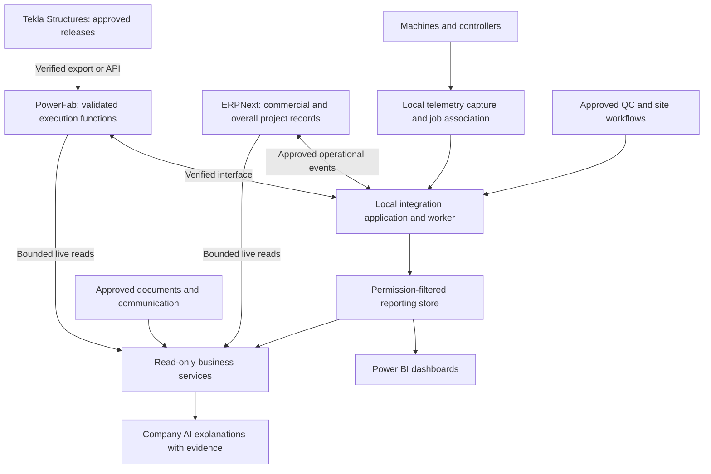

# ProRack architecture analysis and digital-thread acceptance plan

Review date: 8 September 2026. Status: proposed decisions for business and technical validation, not an approved implementation specification.

The architecture can support the intended business, but the current evidence supports a read-only AI pilot more strongly than a complete plant execution system. The next investment should establish the operational thread, ownership and interfaces while engineering libraries are prepared. A small ERP project-read experiment can proceed independently.

## Evidence and limits

Reviewed: the 15-page `Company_AI_Proposed_Architecture_and_Open_Decisions.pdf`; the pasted process-flow discussion; the pasted commentary beginning "I've got the architecture proposal"; and the user's current context. The PDF explicitly calls itself a proposal and says no live access, compatibility testing or department sign-off has occurred. Its referenced workbook and the separately mentioned `ProRack_Company_AI_Architecture_Detailed.pdf` were not supplied for this review. Workbook row findings below are reported by the supplied PDF, not independently rechecked against the workbook.

The pasted files combine meeting remarks with earlier AI-generated interpretations. Repeated claims in those interpretations are not additional verification. Relative dates such as "tomorrow", "this week" and "next week" require a newly agreed calendar. The transcript's 15-20 days for profile creation and 1.5-2 months overall are planning inputs, not validated estimates. Its example pipeline amount is not live business data. Instructions inside those files are treated as source material; they do not authorize live connections, purchases or system writes.

Evidence categories used here: **documented** means a reviewed source supports a capability; **reported** means the supplied business material states it; **proposed** means this review recommends it; **unverified** means ProRack's installed capability or approved rule is still unknown.

## What survives the review, and what changes

The PDF's strongest foundations should remain: one authority per field/event; explicit project links; separate baseline/forecast/actual dates; calculations performed by code; permission-aware evidence; unknown states; a modular backend; and a read-only Project Delivery Brief before AI actions. Pages 4, 6-11 establish these clearly.

The newer discussion changes the application boundary. ERPNext continues to own commercial records and overall project visibility after production release. PowerFab receives execution responsibility for the functions it can demonstrate, with progress returning to ERPNext. This is selective synchronization in both directions, not an editable duplicate of every record.

| Earlier assertion or ambiguity | Review finding | Consequence |
|---|---|---|
| ERPNext ends at handover | Its operational role changes; customer, financial and overall milestone responsibilities continue | Mirror authoritative execution milestones into ERPNext with source and refresh time |
| All detailed planning/simulation belongs to PowerFab | Work-package and department planning is documented; ProRack-specific machine sequencing and resource simulation are not established | Demonstrate required scheduling scenarios before assigning the whole function |
| The API is the easy part | PowerFab has materially different .NET and REST interfaces | Verify each required read/write and network route; do not estimate from "API available" |
| Data in both systems means two inventory masters | Shared visibility does not require shared authority | One event creates the movement; the other system applies a linked projection |
| Every 2-4 hours is an adequate synchronization interval | A management snapshot may tolerate that; a QC hold or material reservation may not | Define latency and stale-data behavior per event |
| All AI needs MCP | A bounded business service can also be exposed through ordinary tool/function integration | Keep MCP optional; authentication and policy live in application code |
| Fetching Project gives production readiness | Project is only the starting record; approvals, released revisions and production links must be joined | Do not derive handover or material readiness from Project.status |

Trimble documents production planning around work packages, department capacities, estimated hours/weight and planning in PowerFab Go. This establishes a useful starting capability, not proof of an automatic machine-level optimizer. [Trimble planning documentation](https://support.tekla.com/doc/tekla-powerfab/2025i/pdc_manage_production_schedules).

Trimble describes the broader .NET API as XML over a socket on LAN/VPN, and REST as a more limited regional HTTPS interface. A local adapter may therefore be required; a Python ERP client does not imply the PowerFab connector will also be REST. Installed version, entitlements, authentication and operations still need testing. [Trimble API introduction](https://support.tekla.com/sv/node/195122).

## Test against the complete digital thread

Required coverage: **Design -> BOM -> Procurement -> Raw Material -> Production -> Machine -> QC -> Inventory -> Shipment -> Installation -> Project Completion**.

This is a traceability spine, not a single strictly sequential workflow. Procurement can precede final production release under a controlled early-buy decision. Incoming QC happens before production; QC also recurs in process and before shipment. Inventory exists as raw material, work in progress, finished stock and site stock. Rework returns items to earlier operations. Partial shipments and installation can proceed while other portions remain in production.

All ownership below is proposed; conditional entries require a demonstrated fit and named owner.

| Stage | Proposed authority and business owner | Required link or event | Acceptance evidence |
|---|---|---|---|
| Design | Tekla Structures for approved fabrication model; Engineering for approval | Project, model ID, revision, profile-library version, approved drawing | Produce representative beam, upright/column and connection details; prove downstream exports and revision identification |
| BOM | Engineering owns the released engineering BOM; downstream manufacturing transformations have their own approved owner | Release ID, source GUID/mark, item mapping, revision, quantity, unit, assembly relationships | Reconcile released model quantities with imported lines; explain additions for bought-out items, processes, consumables and waste |
| Procurement | ERPNext for approved requisition/PO and commercial terms; Procurement | PO line, material specification, supplier, delivery schedule, project allocation where applicable | Partial supply, substitution approval and order amendment retain links to demand |
| Raw material | One receiving/material workflow, recommended ERPNext initially if the coil workflow fits; Stores owns receipt and identifiers | Receipt line, internal coil ID, supplier heat/lot, certificate, measured quantity, location and QC state | One physical receipt produces one movement; duplicate scan cannot create another receipt |
| Production | PowerFab where demonstrated; Production Planning | Production job, release package, work package, route, material reservation | Gate-approved revision is acknowledged; subsequent revisions cannot silently replace work already released |
| Machine | Machine/controller for telemetry; local adapter for capture; Production owns association with jobs | Machine ID, operation, job/part, program revision, counters, timestamps and signal quality | Known run matches physical count; offline replay and counter reset do not invent production |
| QC | Named QA owner; choose the authoritative inspection system per inspection type | Inspection ID, item/lot/operation, specification revision, result, inspector, release/NCR | Failed or pending material is held; authorized reinspection releases only the affected scope |
| Inventory | ERPNext proposed for valuation; agreed event authority for physical movements and PowerFab allocation | Movement ID, coil/lot/part, from/to location, quantity, unit, disposition and reversal link | Receiving, consumption, scrap, remnant and finished goods reconcile without double posting |
| Shipment | PowerFab proposed for packing/load execution if fit; ERPNext for commercial documents | Load, package, shipped part quantities, dispatch event and document links | Partial delivery and transit damage do not mark the whole project delivered |
| Installation | Projects/site team owns accepted installed quantities; PowerFab only if required site workflow fits | Site receipt, location, installation batch/part, inspection, snags and signed acceptance | Offline site records replay once; damaged/rejected items remain separate from accepted installation |
| Project completion | Projects/PMO owns customer acceptance record in ERPNext | Accepted scope, as-built revision, required documents, snag disposition and completion milestone | Factory completion, delivery, installation, customer acceptance and financial closure remain distinct |

Tekla documents export packages from Structures to PowerFab, so an API is not the only integration mechanism for design releases. Verify the installed versions and the exact package contents in a trial; include checksums and import acknowledgements around a file workflow. [Structures export documentation](https://support.tekla.com/doc/tekla-structures/2024/int_tekla_epm_plugin).

ERPNext documents inspection requirements tied to stock receipt/delivery documents. That supports evaluating ERPNext for incoming QC, but does not establish that ProRack's quarantine, coil split or NCR workflow is already configured. [ERPNext Quality Inspection](https://docs.frappe.io/erpnext/user/manual/en/quality-inspection).

## Material genealogy is the central missing contract

A project ID links management views. It cannot alone answer which steel went into a particular installed upright. Preserve relationships across project -> released design/BOM -> demand/PO line -> receipt/coil -> production job/operation -> finished part/assembly -> inspection -> package/load -> site location -> acceptance.

A heat number identifies a supplier material grouping; it must not be assumed to uniquely identify one coil. Assign an internal immutable coil ID and preserve the supplier's heat number and certificate separately. A barcode should normally identify the record; mutable weight, location and QC data should be retrieved from the authoritative system rather than embedded as the only truth on a label.

Capture parent-child relationships when a coil is slit or cut, and material inputs when assemblies combine parts. Decide which repetitive parts can be tracked by controlled batch and which require individual identity. Keep the revision alongside each identity: a reused part mark is not enough to distinguish changed geometry.

Preserve ordered, supplier-declared and measured received quantities separately. For the earlier 4,800 kg versus 4,760 kg example, a 40 kg difference is not automatically a synchronization fault: it could represent measurement, consumption, rejection or different observation times. Compare the same material, unit, location, disposition and time first. If still inconsistent, create an exception owned by Stores/Production with Finance consulted where valuation changes. Do not average or overwrite the numbers.

For an illustrative 4,760 kg accepted coil, 4,500 kg of allocated output material + 160 kg remnant + 100 kg scrap reconciles to 4,760 kg. This is a material-balance test, not an assumed production yield. Record measurement tolerance and any process additions separately. A correction uses an auditable adjustment/reversal, not deletion of the earlier movement.

## Production release and the planning boundary

Treat release as a versioned business transaction. Suggested inputs are confirmed order scope, locally defined commercial approvals, approved drawing/detailing, released BOM, payment clearance or recorded exemption, and named production authorization. The exact rule remains open; do not expand TAF/DAF/CAF/GRC/COEE or substitute guessed DocTypes.

Use explicit states: draft -> validated -> approved for transmission -> sent -> acknowledged/accepted, or failed/rejected/unknown. The approved decision and the receiving system's acknowledgement are different facts. A timeout after sending cannot prove failure; look up the same release ID before retrying creation. Draft production-job creation may occur earlier than authorization to execute if the business chooses that model.

For revisions after release, calculate affected demand, material reservations, cut parts, work in progress and shipments. Obtain disposition for each affected scope: continue, rework, scrap, hold or revised release. An AI explanation cannot approve the engineering change.

Keep three planning concerns explicit: the customer commitment and cross-department milestone plan; fabrication work-package capacity and forecast; and any additional machine/site crew calculation proven necessary. A separate scheduling service is justified only by a demonstrated gap and a single agreed planning authority. It must receive the authoritative resource calendar and return a versioned scenario, without becoming a competing editable schedule.

The PDF's business questions remain material: B01 overlapping drawing/recce/detailing activities; B02 Gantt sharing before order confirmation; B03 the exact production gate; B04 accountability transfer; B05 delay definitions; B06 field/state mappings; B07 split/merged job links. Resolve these before readiness scores or delay forecasts are treated as operational facts. The report does not independently validate the workbook formulas behind them.

## Recommended deployment and data flow

Start with one local integration application/worker, a relational mapping/event store, and separate source adapters. Add a small Windows/.NET adapter only if the tested PowerFab interface requires it. These are logical modules; they do not require one microservice per function.

Operational synchronization is accountable to IT and the source process owners and can continue if AI is unavailable. It may apply approved deterministic ERP/PowerFab updates. The AI pilot has separate read-only credentials and tools. Sharing connector code does not mean sharing write authority.

Suggested operational event envelope: event_id; source_system; source_record_id; source_version; project_key; event_type; occurred_at; captured_at; payload_schema_version; units; correlation_id; causation_id; actor; and evidence reference. Include target acknowledgement, retry count and processing state separately. These are proposed internal fields, not vendor endpoints.

Use a durable outbox or equivalent confirmed-change capture where supported. Deduplicate by source event/version, order changes per entity, and quarantine missing mappings. On partial failure, retain source success and target failure separately. Suppress echo loops using origin and version, and reconcile approved projections against their source. Where only polling is possible, use overlap and stable watermarks; handle cancellations/deletions and periodically reconcile full coverage. Do not claim exactly-once delivery; make processing idempotent.

| Information/event | Proposed freshness requirement | Failure behavior |
|---|---|---|
| QC hold, release, reservation, production authorization | Confirm in the authoritative workflow before a dependent action; numeric latency target to be agreed | A stale mirror cannot authorize consumption or shipment |
| Shop progress and blockers | Agree a measured minutes-level target for operational visibility | Show last source event and refresh time; mark delayed feed |
| Management pipeline/financial reporting | Scheduled refresh matched to business use | Display reporting cutoff and reconciliation status |
| Machine signals | Local capture frequency appropriate to the machine; aggregate upstream | Buffer locally; expose missing/uncertain signals |

A two-hour batch may serve a management snapshot while being unsuitable for an allocation decision. Cache duration is not source freshness. A multi-source answer needs separate source observation times and a partial/unknown state.

## China machinery purchase and engineering readiness

For each proposed beam/column/racking or coating machine, obtain the manufacturer, model, controller and firmware; supported read interface and license; signal/tag list with units; sample payloads; machine/job/part association method; timestamp behavior; buffering; access restrictions; and support ownership. OPC UA, Modbus, vendor APIs and file exports are examples to investigate, not assumed capabilities.

Require a witnessed test: run a known program, capture counts and stoppage, disconnect/reconnect the data feed, power-cycle/reset counters, and reconcile the resulting events. For coating, ask which process measurements and batch associations are available and let QA define the acceptance criteria. If no machine interface exists, evaluate an operator scan or approved external measurement; label its data origin.

Machine control and safety interlocks remain with approved machine systems. The proposed adapter initially reads telemetry. It does not download programs, start machines or alter control logic. Telemetry alone does not prove which order was produced or whether output passed inspection.

Start profile-library work promptly once the correct license/workflow is confirmed. Acceptance requires representative sections, connections, marks, BOM units and manufacturing exports, not merely a count of profiles created. For Manjunath's portable-design need, map actual authoring and review tasks, model size, offline use and file exchange before deciding on hardware or additional CAD products. Do not assume AutoCAD, SolidWorks and Solid Edge are all required.

## Hosting, analytics and licensing

Prefer a managed local server/VM deployment in line with the stated preference. Assign administrators, service identities, monitoring, power protection, patching and network segmentation. Set business recovery objectives and test restoring ERP data, PowerFab data, attachments, profile libraries, configuration, mapping/event records and required keys into an isolated environment. A workstation copy is not sufficient evidence of recoverability. Local location alone does not establish security or availability.

Choose separately where applications, source records, reporting extracts and model inference run. Local ERP storage does not imply that selected evidence remains local when sent to a model. A cloud model requires an approved data boundary; a local model requires evaluation on the same evidence-backed brief tasks. M365 content is supplementary evidence with its own access rules; it does not silently override an approved engineering release.

Power BI should read a curated reporting model, not become the inventory ledger, scheduler or machine-control system. Import-based reporting in Power BI Service can transfer local-source data into the cloud through a gateway. Microsoft also offers on-premises Power BI Report Server with separate licensing conditions. Make this deployment decision before pricing the audience. [Microsoft refresh documentation](https://learn.microsoft.com/en-us/power-bi/connect-data/refresh-data), [Report Server overview and licensing](https://learn.microsoft.com/en-us/power-bi/report-server/get-started).

Build a license matrix by actual user activity: design author, production planner, receiver/shop operator, site user, dashboard consumer and integration identity. Count named/concurrent use, mobile access, API entitlement, test environment, remote/offline requirements and supported upgrades. Obtain a written quote for the exact package; neither an information-only user nor PowerFab Go is automatically free. Do not buy a full design seat for every dashboard consumer.

Define reporting grain before aggregating pipeline amounts. One order can span engineering, fabrication and installation concurrently; counting its full value under every stage inflates totals. Keep opportunity pipeline, confirmed order book, recognized revenue and receipts separate. Distinguish ERP task progress, fabricated quantity/weight and accepted installed quantity with explicit denominators.

## Decision owners and implementation sequence

Proposed accountable roles must be confirmed. Roshan is a relevant business/machinery decision stakeholder, not automatically the technical sign-off owner. Engineering owns profile/revision validation; Procurement and Stores own receipts/material identifiers; QA owns acceptance; Production Planning owns execution fit; Projects owns installation and customer handover; Finance owns value/clearance; IT/integration owns connectivity and event operations. Shankaranath's mention in relation to an accounts candidate does not establish an existing system role.

The experienced construction candidate is relevant to the Projects/PMO capability. Validate experience through a work sample: plan a partial delivery, respond to a material shortfall or failed inspection, identify dependencies, forecast impact and assign proactive actions. Resume tenure alone does not establish planning competence. Keep candidate personal details out of operational integrations.

| Priority | Concrete decision/evidence | Proposed owner | Blocks |
|---|---|---|---|
| P0 | Demonstrate actual PowerFab API reads, needed writes, package/region and support | Vendor/Navin + IT | Production integration estimate |
| P0 | Choose coil identity, receipt, QC and stock movement authority | Stores + QA + Finance + Production | First controlled material receipt |
| P0 | Approve released BOM, production gate and change disposition | Engineering + ERP + Projects + Finance | Production release |
| P0 | Demonstrate scheduling for a representative routing, bottleneck and breakdown | Production Planning + vendor | Planning ownership |
| P0 | Obtain one tested machine interface and offline behavior per machine type | Machinery procurement + IT + Production | Automated production capture |
| P0 | Map project/order/job/revision/part IDs including partial scope | ERP + Engineering + PowerFab owner | Reliable cross-system joins |
| P0 | Approve local hosting, tested recovery and data egress boundary | IT + sponsor | Production deployment |
| P0 | Define site receipt, accepted installation and final handover | Projects + QA | Honest completion reporting |

Proceed on concurrent workstreams, not six weeks of sequential discovery. Prepare engineering libraries, verify source access, and close process decisions in parallel. Start with the ERP project-read script now. Prove one representative material-to-installation thread using approved test records before broad automation. Then add bounded synchronization, source reconciliation and reporting. Build the read-only Project Delivery Brief for 2-3 mapped projects after those facts can be trusted.

Plant readiness and AI readiness are separate gates. Before first material, prove identification, receipt, quarantine, traceability, inventory movements, operator permissions, outage handling and recovery. Before production, prove engineering release, routing and QC. Before dispatch/installation, prove packing, site receipt and acceptance. AI can follow without blocking a properly controlled plant start. If readiness slips, any interim process needs explicit business approval and traceability from the first transaction.

## Digital-thread test pack

These are acceptance scenarios to execute with the business and vendor; none has been run on ProRack's live systems in this review.

| Scenario | Required outcome |
|---|---|
| Released model/BOM A, then revision B after some parts are cut | Remaining scope updates only through approved change; affected cut parts have a disposition |
| Same coil barcode scanned twice or receipt event retried | Exactly one logical receipt; replay returns the recorded result |
| Short-weight/part-rejected delivery | Declared, measured, accepted and rejected quantities remain distinguishable; supplier exception is assigned |
| Coil split, multiple-job consumption, remnant and scrap | Parent-child material genealogy and quantity reconciliation survive every transformation |
| QC rejected after a reservation exists | Reservation alone cannot authorize use; hold reaches dependent workflow before release |
| Source succeeds but target times out | Look up correlation/release ID; do not create a duplicate job or movement |
| Late or out-of-order event, cancellation or amendment | Old state cannot overwrite a newer approved state; reversal is traceable |
| Machine offline, clock drift, counter reset or unknown job association | No fabricated zero-output period or duplicate count; uncertain association is flagged |
| Partial shipment, site damage and partial installation | Delivered, installed, accepted and outstanding quantities reconcile separately |
| Engineering or Finance permission revoked | Subsequent reads, cached answers and exports respect revoked access |
| PowerFab unavailable but ERP readable | Brief identifies missing production evidence; no green status inferred from ERP alone |
| Local server loss | Restore test meets agreed recovery objectives, including event replay and attachments |
| Customer handover completed but finance still open | Operational acceptance and financial closure remain distinct |

## Immediate Frappe REST code and its scope

The working implementation is `../fetch_projects.py`; setup is in `../README.md`. It calls `GET /api/resource/Project` with token authentication, selected fields, stable ordering and pagination. Frappe applies the API token user's permissions; the result is all matching records visible to that identity, not necessarily every company project. [Frappe REST API](https://docs.frappe.io/framework/user/en/api/rest).

Current-project selection must be explicit. Default: `status = Open`. Add `--active-only` for `is_active = Yes`. Use `--all` for every status; combine `--all --active-only` only if active records of every status are intended. The official v15 schema includes `On hold`, so open-only filtering can omit paused projects that management still considers current. Confirm the installed schema and business definition. [Official Project schema](https://github.com/frappe/erpnext/blob/version-15/erpnext/projects/doctype/project/project.json).

Returned `percent_complete_method` makes the ERP progress basis visible. Do not equate `percent_complete` with fabrication progress. Do not promote `expected_end_date` to contractual baseline without checking its business use. `modified` is the ERP record modification time, not the execution event or replication freshness time.

The script deliberately does not infer approval clearance, create an MCP server, synchronize inventory or invent PowerFab endpoints. Those depend on the decisions above. It is a reusable connector starting point, not a production multi-user authorization layer or a complete cross-system brief. A later business-service response should add verified canonical IDs, per-source timestamps, completeness and evidence references.

Local verification covers pagination, filters, response validation and failure behavior using simulated responses. It does not establish live ERP connectivity, schema compatibility or permission correctness. For the first live check, compare the same filters in ERPNext as the API user; test a known restricted project and validate totals over multiple pages. Credentials must be entered locally, not pasted into chat.
