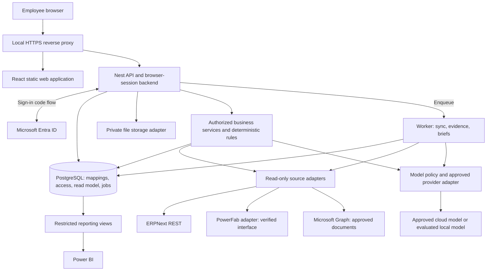

# ProRack software architecture: what to develop

Proposed implementation blueprint | 8 September 2026

This translates the business architecture in `architecture_analysis.md` into a software stack, application modules, API boundaries, deployment model and delivery backlog. It is a design deliverable. The web application, backend, Microsoft tenant integration and model router have not been implemented or deployed. The existing Python ERP project fetcher remains a locally tested discovery tool; no live ERP or PowerFab connection has been verified.

## 1. Recommendation

Build an internal **web application** using **React + TypeScript** in the browser and **NestJS + TypeScript** on a **Node.js** backend. Put business records needed for reporting, project mappings, permissions, jobs and evidence metadata in **PostgreSQL**. Use **Microsoft Entra ID** for employee sign-in. Run a separate worker process from the same backend codebase. Add source adapters for ERPNext, PowerFab and approved Microsoft 365 documents. Route approved AI requests through an application-owned policy to a small set of evaluated models.

Keep the first production deployment on managed local infrastructure because local hosting is the existing preference. Familiarity with Supabase or Cloudflare is valuable, but does not by itself change that requirement. Managed cloud database/storage is an alternative once the business approves the data boundary. Even with local application hosting, Entra sign-in and a cloud model have internet dependencies.

The first release provides project visibility and a read-only Project Delivery Brief. Operational synchronization is a separate module and credential boundary, enabled only for agreed transactions. New receiving, QC or installation screens are built only for proven gaps in existing systems.

### Concrete default stack

| Layer | Default choice | Reason and boundary |
|---|---|---|
| Browser frontend | React DOM + TypeScript + Vite | Fits desktop/tablet project work and existing React skills; internal app does not currently need public SEO or server rendering |
| Navigation and source state | React Router + TanStack Query | Explicit routes and server-state loading, caching and invalidation |
| UI | Tailwind CSS + shadcn/ui; TanStack Table for operational tables | Own the design system; test keyboard use and actual data volumes; select any Gantt component only after a license and capability check |
| Backend | NestJS, TypeScript, Node.js; default HTTP adapter | Organize controllers, services, authorization and connectors in one modular application |
| Contracts | OpenAPI with generated TypeScript client; Zod runtime schemas where shared validation is needed | One approved schema per boundary; test OpenAPI/runtime-schema consistency |
| Data access | PostgreSQL + Drizzle migrations/query layer | Relational cross-system IDs, transactions and auditable changes; keep schema changes in source control |
| Jobs | pg-boss + separate Node worker | Durable background work using PostgreSQL; separate job queues and concurrency budgets |
| Sign-in | Entra ID OpenID Connect through MSAL Node | Use the existing company identity; backend manages a browser session |
| Browser session | Opaque, secure, HttpOnly cookie; session record in PostgreSQL | Keep source/provider tokens server-side; support explicit session invalidation |
| Files, initial local deployment | Private persistent file volume or managed NAS, accessed through an application storage adapter | Small deployment with controlled uploads/downloads; never serve confidential attachments as public static assets |
| Existing approved documents | References to their authoritative repository; Microsoft Graph for approved M365 content | Avoid creating a second drawing/document master |
| ERPNext | TypeScript connector using supported Frappe REST endpoints | Existing Python script supplies the first discovery test; do not run both as permanent production implementations |
| PowerFab | Verified REST operations or a small C#/.NET Windows adapter | Choose from demonstrated installed capabilities, not assumptions |
| AI | Backend model-policy module + provider adapter; OpenAI Responses API as initial candidate | No browser provider keys; approved model IDs live in configuration |
| Observability | Structured application logs, metrics and OpenTelemetry instrumentation | Correlate user request, source calls, jobs and model run without logging confidential payloads |
| Deployment | Managed Linux VM(s), reverse proxy and Docker Compose; Windows host/service for adapter if required | Straightforward first deployment; Compose does not itself provide high availability or backups |
| Verification | Unit tests for rules, connector contract tests, database integration tests, Playwright user flows and AI evaluations | Validate business behavior, permissions and failure cases |

These are recommendations, not claims that dependencies are already installed. Pin compatible supported versions at implementation; do not use floating `latest` tags in production.

React documents Vite with a TypeScript template and separate routing/data-fetching choices. This design accepts that explicit setup in exchange for a simple browser client and a separate integration backend. Revisit a full-stack React framework if requirements later justify server rendering. [React guidance](https://react.dev/learn/build-a-react-app-from-scratch).

Nest supplies the server-side application structure, while Drizzle handles the database layer. pg-boss supports durable PostgreSQL-backed jobs, scheduling and retries; external ERP/model calls still need application-level deduplication and reconciliation. [NestJS](https://docs.nestjs.com/), [Drizzle](https://orm.drizzle.team/docs/overview), [pg-boss](https://github.com/timgit/pg-boss).

## 2. What carries over from React Native / Expo

Hooks, component composition, TypeScript types, asynchronous requests and state-management experience transfer. Browser UI uses HTML elements, CSS, browser accessibility and web routing in place of React Native primitives and native navigation. Build for a desktop planner with large tables and a tablet operator with touch targets; these can be responsive views of the same application.

Expo is a possible later companion for a demonstrated mobile requirement: managed scanner SDKs, reliable native background behavior, device integration or a substantial offline site workflow. It is not required for the first office dashboard. If added, share API contracts, validation and selected business logic; do not assume all UI components will be shared.

A web/PWA scanner proof should test the actual camera/scanner/browser. Keyboard-wedge scanners can be evaluated with normal inputs. Installability does not automatically provide reliable background sync. Do not promise offline operational writes in the first read-only pilot.

## 3. Supabase and Cloudflare: precise roles

Supabase is a backend platform with PostgreSQL and additional services. Cloudflare R2 is object storage; Workers is a compute platform. Database rows, large files and long-running integration jobs have different requirements. NestJS remains the home of ProRack's business policy even if infrastructure services come from these platforms.

| Deployment option | Components | Use when | Main tradeoff |
|---|---|---|---|
| **Recommended local baseline** | Local Node services + PostgreSQL + private managed file storage + direct Entra sign-in | Preserve existing local-hosting preference | ProRack/IT operates patching, monitoring and tested recovery |
| Local Supabase variant | Self-hosted Supabase PostgreSQL/Storage behind the same Nest API | Team explicitly wants the additional Supabase services and will operate the stack | More moving parts; not the same operations/features as managed Supabase |
| Approved cloud/hybrid variant | Managed Supabase PostgreSQL; choose Supabase Storage OR R2 for app-owned files; retain local adapters | Cloud storage/processing is approved and its operational benefits justify it | Network dependency, additional processing boundary and service-specific operating costs |

Do not run Supabase Storage and R2 as two editable masters for the same attachments. Put an interface such as `put`, `openReadStream`, `deleteVersion`, and `stat` around storage. Preserve document metadata and authorization in the backend so the storage implementation can change. Keep old source links and object versions valid during migration.

Self-hosted Supabase places backups, security, availability and maintenance on the operator; its local development CLI stack is not a production deployment. [Supabase self-hosting](https://supabase.com/docs/guides/self-hosting).

If using Supabase, choose one login/session design. The recommendation is direct Entra login into the Nest backend, with Supabase used as infrastructure. An alternative is Entra through Supabase Auth, but then deliberately map the resulting user/session and roles; do not bolt two independent sessions together. Supabase documents a Microsoft login provider, but identity login alone does not implement ProRack project authorization. [Supabase Microsoft login](https://supabase.com/docs/guides/auth/social-login/auth-azure).

Do not assume an Entra token is automatically a Supabase user token. A server secret/service credential can bypass database row policies; client-side filters cannot compensate. Use restricted database roles, explicit access-scoped queries and separately verified row policies. Never put administrative storage/database keys in the browser. [Supabase RLS](https://supabase.com/docs/guides/database/postgres/row-level-security).

R2 location hints and jurisdiction restrictions are different controls; an APAC hint is not a promise that data stays in India or inside the plant. Approve any cloud media and backups by data category. [R2 data location](https://developers.cloudflare.com/r2/reference/data-location/).

Cloudflare Workers could host a future cloud-facing gateway. It is not the default execution environment for the local integration worker or a Windows PowerFab adapter. A serverless runtime needs compatibility and resource-limit assessment; it does not create network access into the plant. [Workers limits](https://developers.cloudflare.com/workers/platform/limits/).

## 4. Application and network structure



This diagram covers the read-only foundation. Later operational updates use a separately enabled integration command module and execution identity, not the read-only adapter or model credential. Machine event capture and approved file import feed the worker through authenticated internal endpoints.

Use one browser origin, for example an IT-approved internal hostname, with `/` serving React, `/api/v1` serving application endpoints and `/auth` serving login/callback/logout. Deep links must fall back to the frontend router. Do not expose PostgreSQL, PowerFab sockets, private file volumes or machine controllers to browser clients.

The Linux host reaches ERPNext locally. If PowerFab requires .NET, use a supported Windows service with an authenticated internal HTTP contract; the Node backend calls that adapter. Keep ERP/PowerFab databases vendor-managed and use supported integration interfaces. If cloud services are later adopted, choose an approved VPN/private route or authenticated outbound connector; do not assume DNS or MCP establishes reachability.

## 5. Microsoft 365 authentication and user-level access

Microsoft 365 employees normally have identities in Microsoft Entra ID. Configure a **single-tenant web application registration** for the pilot. Use the backend confidential-client authorization-code flow, with PKCE, state and nonce checks through supported libraries. The backend exchanges the code, validates the identity and creates its own opaque session. Tokens and token-cache encryption keys stay on the server. The browser holds the session cookie, not ERP keys or model keys. [Microsoft authorization-code flow](https://learn.microsoft.com/en-us/entra/identity-platform/v2-oauth2-auth-code-flow), [MSAL Node token acquisition](https://learn.microsoft.com/en-us/entra/msal/javascript/node/acquire-token-requests).

The app registration type must match this BFF design: the callback is a web callback, not a public SPA callback. Use a production certificate/credential managed by IT and register development callbacks separately. Requests that change application state need CSRF protection and origin validation even though the pilot does not modify ERP records. Do not rely on SameSite alone.

Use immutable Entra `tid` plus `oid` to link employees. Email is display/contact information, not the identity key. Reject unapproved tenants; explicitly decide guest access. On logout, revoke the application session. On role/account changes, invalidate relevant sessions and cached grants through the chosen lifecycle mechanism, with a defined revalidation interval. Do not promise instantaneous revocation from a long-lived cached role claim.

Entra supplies authentication and coarse app roles. ProRack supplies the meaning of those roles, project membership, field restrictions and source access mappings. Microsoft supports app-role claims, but your backend must enforce them. [Entra app roles](https://learn.microsoft.com/en-us/entra/identity-platform/howto-add-app-roles-in-apps).

Proposed authorization rule:

```text
Allowed = approved tenant
          AND valid current application session
          AND permitted action
          AND permitted project/scope
          AND permitted fields/documents
          AND approved source-access policy
```

Suggested roles are Viewer, ProjectManager, Engineering, Stores, Production, QA, Finance and IntegrationAdmin. They are configuration proposals, not actual directory roles. A technical integration administrator should not automatically receive financial document access. A project manager may see schedule and blockers without seeing every invoice or employee record.

Authorize before source retrieval, tool execution, download, export and AI context assembly. Recheck saved briefs when they are viewed; a source link that denies access does not undo leaked prose in an already-visible answer. Scope browser and server caches by user/access policy, and clear them on logout or account changes.

ERPNext token requests run as the token's ERP user. Entra sign-in does not impersonate that user automatically. Choose either a supported per-user source identity or a narrow service account over an explicitly approved reporting dataset, with backend user/project/field filtering. If a source-to-employee permission mapping is uncertain, deny the affected evidence instead of using an administrator key. [Frappe REST authentication](https://docs.frappe.io/framework/user/en/api/rest).

For interactive Graph reads, acquire a delegated Graph token using the backend's authorized user token cache. If a future independent SPA/native client presents an access token for your API, use the appropriate on-behalf-of exchange for Graph; do not forward a token with the wrong audience. The current BFF does not need OBO merely to use Graph. [Microsoft OBO flow](https://learn.microsoft.com/en-us/entra/identity-platform/v2-oauth2-on-behalf-of-flow).

For unattended document ingestion, use a separately approved application identity with resource-scoped permissions where supported. Selected SharePoint permissions require both consent and explicit resource grants; a selected scope alone is insufficient. Application access is not the current viewer's access, so recipients and derived-content ACLs still need enforcement. Start with an approved project library before adding mailboxes or Teams messages. [Graph selected permissions](https://learn.microsoft.com/en-us/graph/permissions-selected-overview).

Local hosting does not make Entra authentication offline. Agree behavior for identity-provider outages: existing sessions only within approved validity, no new unauthorized sessions, and no automatic admin bypass. The plant's established operational continuity plan must not depend on Company AI login.

## 6. Frontend screens and backend modules

| Screen | What the employee can do | Backend module | First-release scope |
|---|---|---|---|
| Sign-in / access denied | Sign in with Microsoft; understand missing assignment | Identity/session/access | Yes |
| Project list | Filter open/active/on-hold projects and see source freshness | Projects and source mappings | Yes; actual status values discovered from ERP |
| Project workspace | See milestones, readiness evidence, owners and source links | Project context and milestone read model | Yes; unavailable sources marked unknown |
| Delivery Brief / Ask | Ask a bounded project question and inspect citations | Briefs, rules, retrieval, model policy | Yes after evidence joins work |
| Exceptions | See stale source, missing mapping and reconciliation issues | Integration health/exceptions | Yes for authorized users; manual dispositions are app audit records |
| Documents/evidence | Open approved documents and versions | Document access and storage | Narrow pilot library |
| Reporting | Open approved Power BI report or operational overview | Reporting access | Link initially; embed later if justified |
| Integration administration | Inspect last success, queue failure and mapping status | Connector operations | Restricted; diagnostic detail must not leak secrets |
| Receiving/QC/site capture | Enter missing domain events and attach evidence | Operational commands | Later, only for confirmed source-system gaps |

Project detail may have stage sections for engineering, procurement, material, production, quality, shipments and installation. Visibility does not imply a full new application for each department. Link to existing source screens when users should perform the action there.

Load the initial project screen from a bounded, access-filtered read-model request rather than many per-row ERP calls. Use server pagination, filter allowlists and stable cursors. UI states must distinguish loading, empty, denied, stale, partial and failed. A cached ERP project percentage must retain its calculation basis.

Return `202 Accepted` and a job ID for long briefs/refreshes. Use authenticated server-sent events for run status and completion; authorize reconnects and each run ID. Initially stream progress only and release the completed answer after schema/citation checks, avoiding unvalidated text appearing as a finished finding. WebSockets are unnecessary for this one-way progress stream.

## 7. APIs: three separate categories

### A. Application APIs we build

These are **proposed ProRack routes**, not existing ERPNext or PowerFab endpoints.

| Route | Purpose and access |
|---|---|
| `GET /auth/login`, `GET /auth/callback`, `POST /auth/logout` | Microsoft login/session lifecycle; callback binds state/nonce and logout checks CSRF |
| `GET /api/v1/me` | Current user, app capabilities and access-scoped preferences |
| `GET /api/v1/projects?status=Open&active=true&cursor=...` | Paginated project projection; enforce membership before returning rows/counts |
| `GET /api/v1/projects/{id}` | Approved project summary and source coverage |
| `GET /api/v1/projects/{id}/milestones` | Baseline/forecast/actual by milestone and calendar |
| `GET /api/v1/projects/{id}/readiness` | Deterministically evaluated gates: satisfied, blocked or unknown |
| `GET /api/v1/projects/{id}/evidence` | Authorized evidence metadata and references |
| `POST /api/v1/projects/{id}/brief-runs` | Create a read-only brief job; idempotency key and usage budget |
| `GET /api/v1/runs/{id}`, `GET /api/v1/runs/{id}/events` | Authorized job status/result and SSE progress |
| `POST /api/v1/runs/{id}/cancel` | Cancel outstanding work where possible; account for already incurred calls |
| `POST /api/v1/projects/{id}/questions` | Validated question, optional conversation ID; bounded answer job |
| `POST /api/v1/projects/{id}/refresh-requests` | Coalesced refresh request with per-source quotas; does not bypass rate limits |
| `GET /api/v1/evidence/{id}/content` | Reauthorize and stream an approved source or stored file |
| `GET /api/v1/integrations/health` | Access-scoped freshness and connector health |
| `POST /api/v1/admin/source-mappings` | Audited mapping change; restricted to responsible data/integration owner |

Later media endpoints can accept an upload into quarantine and mark it ready only after validation/scanning and authorization. Separate application writes, such as saving a question or reviewer feedback, from business-source writes. The read-only pilot can store its own metadata without changing ERP records.

### B. Source APIs and interfaces we consume

| System | Interface | Intended use | Dependency |
|---|---|---|---|
| ERPNext/Frappe | `GET /api/resource/Project`; later verified DocType resource reads and approved custom methods | Projects, commercial milestones and mapped approvals | Actual installation, permissions, fields and network route |
| Entra | OIDC metadata/authorize/token endpoints through MSAL | Employee sign-in and source token acquisition | Tenant administrator registration, credential and assignments |
| Microsoft Graph | Approved `/v1.0/sites`, `/drives` and drive-item operations | Project library metadata/content and changes where supported | Delegated or selected application permissions for exact resources |
| PowerFab | Vendor .NET API or supported regional REST endpoints | Jobs, inventory/progress and milestones as demonstrated | Version, entitlement, endpoint capability and SDK/network compatibility |
| Tekla Structures | Supported PowerFab export package; Open API only if needed and licensed/supported | Approved model/BOM/drawing release ingestion | Versioned export sample and revision mapping |
| Machines | Verified vendor protocol, file export or local read adapter | Counters, timing and process signals tied to jobs | Per-machine controller/protocol test; never assume one common API |
| Model provider | Server-side provider API, initially evaluating OpenAI Responses | Structured extraction/explanations over approved evidence | Separate API account/billing, available models and data policy |
| File storage | Private filesystem adapter initially; Supabase Storage or R2 API if selected | App-owned attachments and generated artifacts | Storage policy, retention, capacity and restore test |
| Power BI | Curated database views and approved connector; embedding APIs only if used | Management reports | Report distribution, data boundary, viewer access and licensing |

Do not invent endpoints such as `PowerFab /production-status` and assume the vendor implements them. Wrap verified vendor operations behind internal interfaces such as `PowerFabReader.getJobProgress()` and publish your own adapter contract. Trimble documents materially different REST and .NET interfaces. [PowerFab API introduction](https://support.tekla.com/sv/node/195122).

### C. Internal connector and tool contracts

Source adapters return normalized data with source IDs, source modification/event times, retrieval time, mapping version and completeness. Proposed internal operations include `listProjects`, `getCommercialMilestones`, `getApprovalEvidence`, `getProductionMilestones`, `getMaterialExceptions`, and `readApprovedDocument`. Each operation is implemented only after field discovery.

Authenticated internal ingestion routes, such as `/internal/v1/source-events`, accept only allowlisted event schemas from registered connector identities. They do not accept arbitrary ERP paths, SQL, user impersonation or provider credentials. A browser employee token is not a connector execution identity.

Business services can later be exposed as MCP tools to other approved AI clients. The same permission checks apply. For the first in-app AI, provider function calling can invoke the existing server-side tools directly; a separate MCP server is not required. [OpenAI function calling](https://developers.openai.com/api/docs/guides/function-calling).

## 8. Data model: own context, preserve source authority

Use separate database schemas or clear table ownership for identity, integration, read models and AI metadata. Minimum logical tables:

| Tables | Role |
|---|---|
| `organizations`, `users`, `sessions`, `role_assignments`, `project_memberships` | Entra identity mappings and application access; one approved organization initially |
| `projects`, `source_records`, `project_source_links` | Canonical ID and many-to-many links to orders, ERP projects and production jobs |
| `milestone_facts`, `approval_facts`, `project_snapshots` | Versioned, minimal source projections; no independent editing of authoritative facts |
| `source_events`, `outbox`, `sync_cursors`, `sync_attempts`, `reconciliation_exceptions` | Durable capture, retries, target acknowledgement and recovery |
| `documents`, `document_versions`, `evidence_refs`, `document_access` | Repository/object references, revision, checksum and access scope |
| `brief_runs`, `findings`, `finding_evidence`, `review_feedback` | Reviewed conclusions, citations, unknowns and rule versions |
| `model_policies`, `model_runs`, `usage_ledger` | Evaluated route configuration, actual provider/model, cost and run outcome |
| `audit_events` | Actor, operation, target, decision, timestamps and correlation |

Source record identity should be unique by organization, source, record type and source ID. Keep project-source associations in a separate table so split jobs and orders spanning projects are not forced into a false one-to-one mapping. Store explicit allocated scope where needed.

Later material genealogy uses `material_units`, `material_relationships`, `operation_facts`, `inspection_facts`, `shipment_lines` and `installation_acceptance_facts` as projections or explicitly approved app-owned records. Label their owner. Do not accidentally create a third stock ledger in the AI database.

Suggested API envelope:

```ts
type SourceCoverage = {
  source: "erpnext" | "powerfab" | "documents";
  state: "fresh" | "stale" | "unavailable" | "not_configured";
  retrievedAt: string | null;
  sourceObservedAt: string | null;
};

type ProjectResponse = {
  data: {
    projectKey: string;
    name: string;
    erpStatus: string | null;
    productionStatus: string | null;
  };
  meta: {
    requestId: string;
    completeness: "complete" | "partial";
    sources: SourceCoverage[];
    nextCursor: string | null;
  };
};
```

This is an illustrative contract, not generated production code. Completeness is relative to the authorized requested scope. Do not disclose hidden record counts or confidential source existence. A missing source field is null/unknown, not `false` or zero. Distinguish timestamps, units and calendars explicitly.

Use server-controlled organization/project context, query allowlists, limits and parameterized queries. The browser and model cannot supply a trusted tenant ID. Use a non-owner database role for ordinary requests. If adding RLS, test policies using the actual runtime role, migrations, views and connection pool; a privileged role can defeat apparently correct policies.

## 9. Synchronization, latency and concurrency

Dashboards read approved projections. Explicit freshness requests enqueue bounded source reads. Coalesce identical authorized refreshes and do not fan out one ERP request per UI row. Raw permitted data may be shared internally only inside a correctly protected read model; user-visible answer caches must be scoped to access policy.

Separate queues for source polling, operational delivery, document extraction and AI briefs. Give operational work its own worker concurrency and connection budget so expensive AI calls cannot starve receipt/QC synchronization. Start without Redis; introduce it or separate queue infrastructure only if measured throughput or distributed locking requirements justify it.

Commit captured source events and local queue/outbox intent atomically where supported. Persist target acknowledgements. A worker crash after a successful external write still requires target lookup/deduplication; a queue's delivery guarantees do not make an ERP transaction exactly-once. Retry safe reads with bounded backoff and jitter. For uncertain writes, reconcile before retrying. Handle old events, revisions, cancellations and full reconciliation explicitly.

Polling needs stable ordering/watermarks, overlap, deduplication and cancellation/deletion handling. Webhooks, where available, need authenticated validation and replay protection; run periodic reconciliation because notifications can be missed. Source fields are not overwritten by a competing source just because its message arrived last.

Configure limits after measuring the installed systems: per-source simultaneous calls, requests per interval, query page size, timeout, maximum payload, queue age and maximum retries. Earlier numbers such as 8 PowerFab calls, 20 ERP calls or 500 users were examples, not tested capacities.

Keep high-frequency machine capture at the edge. Where buffering is required, use a durable local store such as SQLite and forward bounded batches of normalized business events/aggregates, retaining raw signals for an agreed period. Do not put every PLC sample into the shared AI job queue. Include machine ID, event sequence, event/capture times, job association and signal-quality flags; acknowledge batches and replay idempotently after reconnection. Add a time-series store only if measured signal volume and diagnostic use justify it.

For a QC hold or production-release gate, a stale read model cannot authorize the dependent physical action. Establish source confirmation and fail/hold behavior in the operational workflow. Management snapshots can use a different refresh interval.

## 10. AI model routing

I interpret the request as task-based model routing; no specific external router product is assumed. Implement a small **model policy module** in the backend. Keep one provider initially with evaluated capability profiles, then add another only for measured quality, availability or policy needs.

| Route | Examples | Execution |
|---|---|---|
| `deterministic` | Fetch projects, filters, totals, date differences, release gate evaluation, quantity reconciliation | SQL/source API/rule code; no LLM |
| `fast` | Known-schema intent classification, extracting specified fields, short summaries of already selected facts | Evaluated lower-cost model plus schema/rule checks |
| `reasoning` | Explain a delay across engineering/material/production evidence, compare conflicting documents, explain a validated scenario | Evaluated stronger model over authorized evidence |
| `document` | Scanned inspection/certificate extraction | OCR/vision capability if approved; validation and human review for consequential fields |

A natural-language "show current projects" request may use a small model to identify filters, but the actual listing is an ordinary authorized API call. The model does not count or enumerate projects from memory. A UI button needs no model at all.

The routing order is important:

1. Authenticate and determine project/field permissions.
2. Apply data-processing policy to the prompt and metadata to determine permitted destinations before any external classifier, OCR, embedding or model call.
3. Resolve the intent within that policy; ask for a project clarification if identity is ambiguous.
4. Select deterministic execution whenever sufficient.
5. Retrieve a bounded amount of authorized, relevant evidence and evaluate source freshness.
6. Choose an evaluated model profile by task capability, risk, context size, latency and remaining cost budget.
7. Execute allowlisted tools with server-controlled permissions and call budgets.
8. Validate schema, citations, dates/quantities, and required evidence coverage.
9. Allow a bounded correction or stronger-model retry only when it can plausibly fix the failure.
10. Return checked output, or an explicit partial/unknown/error result.

Do not route solely from the model's self-reported confidence, question length or words such as "complex". Treat confidence as an untrusted signal unless calibrated against labeled examples. A missing approval or inaccessible PowerFab record is a data problem, not an excuse to try a larger model.

Proposed initial policy settings: maximum one model escalation, explicit total provider-call/tool-call budget, request deadline and per-user/org daily cost ceiling. Approve actual numeric limits after pilot measurements. Classifier calls, retries, document vision, embeddings and failed/abandoned requests must count toward cost.

Keep profile-to-model mappings in versioned configuration, for example `fast -> approved_model_id` and `reasoning -> approved_model_id`. During offline evaluation, establish answer quality with a capable model and compare smaller candidates on the same examples. OpenAI's current model-selection guidance follows accuracy-first evaluation before cost/latency optimization; do not choose by marketing labels alone. [OpenAI model selection](https://developers.openai.com/api/docs/guides/model-selection).

Use exact supported API model IDs selected from the account at implementation; app subscriptions do not establish API access. This blueprint does not claim that a particular model, regional endpoint or price is available in ProRack's account. The initial candidate provider integration is `POST https://api.openai.com/v1/responses`; configure provider retention/storage settings according to the approved data policy. Do not assume `store: false` by itself means zero retention across all provider systems. [OpenAI data controls](https://developers.openai.com/api/docs/guides/your-data).

If using an external model aggregator later, approve that additional processor and constrain both models and downstream providers. An automatic fallback must not change region/data policy or send restricted drawings to an unapproved provider. Your own authorization and budget policy remains in front of any gateway.

Record profile requested, actual provider/model, policy version, prompt/tool-schema versions, source evidence IDs, timing, token/cost usage and validation result. Prefer identifiers/redacted diagnostics to raw sensitive prompts. Do not store hidden model reasoning; store the explainable outcome and evidence.

### Example: "Why is this project delayed?"

The backend checks project access, reads the approved contractual milestone and current execution forecast, retrieves permitted blocker evidence and runs calendar/dependency calculations. A model explains those facts. If the production forecast is unavailable, the answer says so. If material is late but float absorbs it, the application does not automatically report the same delay against customer completion. No model changes the schedule, grants release approval or starts a machine.

## 11. Retrieval, files and evidence

Begin with structured source reads and an approved project document library. Add full-text search over permitted extracted text only when useful. Add vector search only after evaluation shows that simpler retrieval misses relevant evidence. An embedding is also a data-processing operation and must obey the same data boundary.

Store source repository ID, document ID/version, checksum, project links, classification, permitted audience, source modification time and retrieval time. Where snapshots are approved, store their retention and provenance; otherwise retain a source reference and disclose that the live document may change.

Uploads enter quarantine with size/type limits, content verification and malware checks. Use opaque storage keys rather than user paths; apply path traversal protections to a filesystem adapter. Store one immutable object per approved version. A generated brief is also a confidential artifact with a recipient scope. A private volume is persistent storage, not a backup strategy.

For sensitive downloads, proxy through the backend for a current access check. If object storage later uses short-lived signed links, document that a link can remain usable until expiry even after application access is revoked. Never make customer drawings publicly readable for convenience.

Do not let instructions inside drawings, email, PDFs or tool output alter tool permissions, model routing policy or source identities. Citation presence alone is insufficient: evaluate whether the cited record actually supports the claim and whether its revision is authoritative.

## 12. Power BI and the custom web application

Use React for operational navigation, evidence, exceptions and interaction. Use Power BI for management reporting, trends and cross-project analysis. They can read the same governed metrics without building duplicate business definitions.

Start with authenticated links to reports. If embedding is later needed, choose the appropriate organization/customer embedding mode and verify entitlement and row-level report security independently of the React app. Hiding a report link is not authorization, and public publishing is unsuitable for internal business records. [Power BI embedding](https://learn.microsoft.com/en-us/power-bi/developer/embedded/embedded-analytics-power-bi).

Expose narrowly scoped reporting views or datasets, not the application database owner account. Power BI datasets can contain imported copies; application permissions do not automatically carry through. Define report audience, refresh cutoff and row filters. On-premises reporting versus service/gateway deployment remains a separate licensing/data decision.

## 13. Coverage across the digital thread

| Stage | Software we develop | What remains with the authoritative system |
|---|---|---|
| Design | Release metadata/import adapter and approved revision view | Engineering authoring, calculations and approval |
| BOM | Item/profile mappings, version checks, import acknowledgements | Released engineering BOM and approved manufacturing transformations |
| Procurement | Read commercial/demand links; approved synchronization if needed | Requisition, PO and supplier transactions in chosen system |
| Raw material | Coil/receipt reference mapping and exception view; scanner screen only for a demonstrated gap | One authoritative receipt and material identity workflow |
| Production | Job link, release envelope, progress projection | Validated PowerFab execution and planning |
| Machine | Per-machine read adapter, buffering, job association and signal quality | Machine controller, control program and safety systems |
| QC | Inspection evidence projection and hold propagation; capture only if assigned | QA inspection, acceptance and authorized release |
| Inventory | Movement mapping, deduplication, reconciliation | Physical movement/valuation authority; no AI-owned stock ledger |
| Shipment | Load/part/project links, progress projection | Packing/dispatch transactions in selected system |
| Installation | Site evidence and acceptance projection; gap workflow if justified | Projects/site acceptance and snag resolution |
| Completion | Cross-stage brief and outstanding-scope checks | Approved customer handover; separate financial close |

This defines an integration/product boundary. It is not permission to implement every operational write before process ownership and vendor fit are agreed.

## 14. Repository and deployment layout

Proposed future structure, not folders already scaffolded:

```text
prorack/
  apps/
    web/                  React browser application
    api/                  Nest API, auth/BFF, policies and controllers
    worker/               Job entrypoint using shared backend modules
  packages/
    contracts/            API schemas and generated client
    domain/               Project rules, dates, gates and normalizers
    database/             Schema, migrations and access-scoped repositories
    connectors/           ERPNext, documents, storage and adapter clients
    ai/                   Model policy, tools, validators and provider adapter
  adapters/
    powerfab-dotnet/      Only if required by verified vendor interface
    machines/             Only tested per-machine integrations
  tests/
    contracts/            Sanitized fixtures and source-schema checks
    integration/          Database, permissions, replay and failures
    e2e/                  Employee workflows
    evals/                Versioned AI questions and expected evidence
  infra/                  Deployment, backup/restore and operational runbooks
  docs/                   Architecture and decision records
  fetch_projects.py       Existing discovery script, retained initially
```

Use a pnpm workspace for TypeScript packages. Keep an existing Python simulator only if it is validated and useful; isolate its contract/process if needed. Do not introduce Python as a second general backend merely because the first API example was Python. Port the small ERP reader into TypeScript once live field mappings are confirmed, retaining matching fixtures so semantics do not drift.

Developer machines use sanitized fixtures/local services. Staging and production have separate registrations, credentials, databases and storage. Build tested, pinned artifacts; run reviewed database migrations and retain a rollback/recovery plan. Deploy by an approved local pull/runner mechanism. A private network server does not become reachable from a hosted CI runner automatically.

GitHub has not yet been connected to this workspace. Before source control setup, agree the repository, exclude secrets/ERP exports/temp files and commit code plus approved documentation. Database/file backups are separate from Git. Do not grant an untrusted pull-request job access to a privileged plant-network runner or production credentials.

## 15. Delivery sequence and acceptance gates

| Milestone | Deliverable | Exit evidence |
|---|---|---|
| 0. Close technical inputs | Hosting/storage choice, Entra registration plan, ERP field samples, PowerFab capability samples, approved source audience | Concrete records/interfaces and named owners; no invented schemas |
| 1. Web foundation | React shell, Nest BFF, Entra login, project access tables | Assigned employee succeeds; wrong tenant and unauthorized project fail |
| 2. First useful page | ERP project list and project detail through backend | Same authorized records as ERP UI; pagination and source freshness verified |
| 3. Read model and worker | Durable polling, source links, exceptions and health | Duplicate replay, lost response, stale data and restart recovery verified |
| 4. Evidence-based brief | Deterministic gates, narrow document retrieval, one evaluated model | Business-reviewed answers for 2-3 projects; unsupported claims rejected |
| 5. Model optimization | Fast/reasoning routing and usage budgets | Cheaper route meets accepted quality; policy-preserving fallback tested |
| 6. Wider operational thread | Verified PowerFab/machine/site integrations in ownership order | Complete representative material-to-installation trace including exceptions |
| 7. Operational readiness | Restore drill, support owner, metrics and deployment runbook | Agreed recovery/freshness targets and incident response demonstrated |

Vendor discovery, engineering-library preparation and identity/network preparation can proceed concurrently. Do not promise a completion calendar before access and scope are known. The first vertical slice is **employee sign-in -> permitted project list -> source-backed project detail**. It gives value before an AI router or every downstream system is ready.

### Tests that must matter

Verify source-to-user authorization, revoked access to saved briefs, restricted financial fields, wrong-tenant requests, document instructions attempting to change tools, missing sources, invalid source schemas, repeated/out-of-order events, BOM revision after release, partial shipment/installation, and blocked QC material. Verify that model escalation never changes permissions and that a provider failure cannot interrupt operational synchronization.

Evaluate fast and reasoning profiles on the same held-out, business-labeled cases. Measure supported-claim accuracy, citation support, numerical correctness, unknown handling, task completion, latency, cost and escalation rate. A schema-valid answer is not necessarily a correct answer. A stronger model reviewing another model is a useful signal, not the sole ground truth.

### Capacity, cost and operations

Confirm named users, peak simultaneous users, active projects, documents/day and average size, machine signal rates, desired freshness and briefs/day. Measure source and app bottlenecks before sizing servers. No real concurrent-user workload has been tested in this conversation.

Estimate monthly model cost as the sum, per actual route/provider, of billable input, cached input where applicable, output and tool/document processing charges, including retries and escalations. Add database/storage, backups, host operations, identity/reporting entitlement and support. Do not select a cheap model if correction/review costs exceed the saving.

Track source latency, queue age, last successful refresh, mapping exceptions, unauthorized access attempts, database pool saturation, storage errors, run cost and model validation failures. Preserve correlation IDs across worker and adapters. Set recovery point/time objectives with the business and test restoring database, file versions, source mappings, configuration and required keys. For a local outage or lost internet, display capability-specific degradation rather than declaring the entire system healthy or unusable.

## 16. Decisions to record before implementation

The software defaults above are concrete recommendations. The remaining business/environment decisions are: local baseline versus self-hosted/managed Supabase; approved cloud file/model categories; Entra tenant and employee assignments; exact ERP record/permission mapping; demonstrated PowerFab API contract; owned document repository; storage volume/backup operator; model API account and evaluated profile mapping; report distribution; machine interfaces; and GitHub repository destination.

Neither cloud services, Microsoft licenses, PowerFab entitlements nor model accounts have been provisioned as part of this document. The architecture is ready to guide a first implementation slice without pretending those dependencies have already been resolved.
